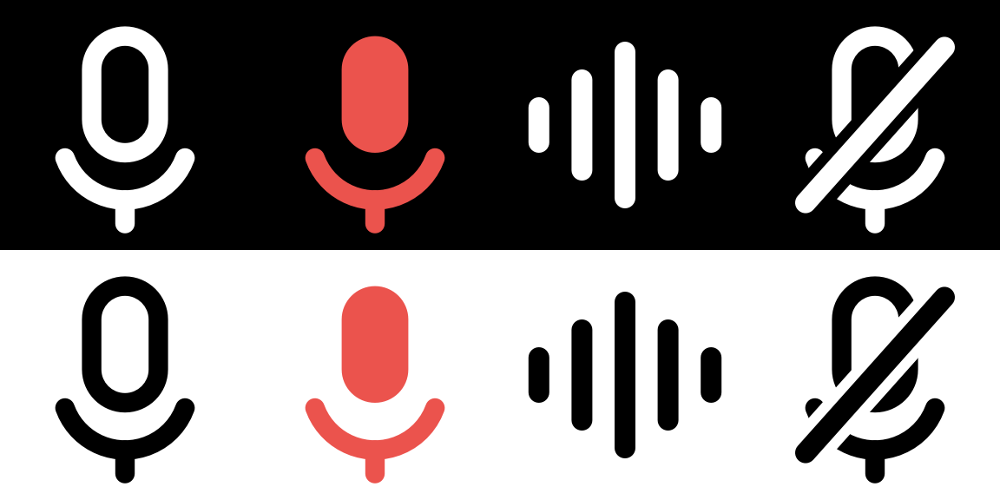

# VoiceSmith

**Speak naturally. Write beautifully.**

A macOS menu bar app that turns dictation into finished writing, without leaving the app you're already in. Double-tap `Shift`, speak, double-tap again — the polished text appears in the text field you were typing in.

Everything is stored on your Mac. There's no account, no sign-in, and no server of ours. With a local model selected, nothing leaves the machine at all.



*Idle, recording, working, and needs-attention — shown on dark and light menu bars.*

---

## How it works

1. **Double-tap `Shift`** from any application
2. **Speak.** A small popup appears at your cursor with a live sound meter
3. **Double-tap `Shift` again.** VoiceSmith transcribes, cleans the text up with an AI model, and writes it into the field you were in

`Escape` cancels and discards the recording.

**The trigger is yours to change.** Setup asks which taps you want, and **Settings › Shortcut** changes them any time: `Shift`, `Control`, `Option`, `Command`, or off. There's a key combination too (`⌃⌥⌘Space` by default), which works even with both taps off. Worth changing if you live in a JetBrains IDE — those use double-tap `Shift` themselves, so until you do, both will fire.

The transcript is *cleaned*, not rewritten: grammar, punctuation, filler words, and false starts are fixed, but the meaning, the facts, and your voice stay yours.

---

## To-dos

**Double-tap `Option`** instead, say what needs doing, and double-tap again. It goes to **Apple Reminders** — nothing is typed into whatever you were working in.

```
"Call the dentist and email Sarah the deck by Friday"

  ☐ Call the dentist
  ☐ Email Sarah the deck      Fri 14 Aug
```

One sentence can hold several tasks, and relative dates — tomorrow, next Friday, end of the month — are resolved against the day you spoke. Say the task itself: *"call the dentist tomorrow"*, not *"add a reminder to call the dentist"*.

Nothing is invented. Most dictation isn't a to-do list, and when there's no action item in what you said, nothing is filed — the popup tells you what it heard instead. What *is* filed appears in a confirmation with **Undo**, which clears itself after a few seconds unless you hover it.

Pick which list in **Settings › General**. To file to-dos from *every* dictation rather than only from double-tap `Option`, turn on **Delivery › Add to-dos to Reminders**.

`Option` is the suggested tap, not a fixed one — change it in **Settings › Shortcut** like the dictation trigger. It's suggested because it's the one modifier with no established meaning when tapped alone: macOS offers "Press Control Twice" for its own Dictation, and JetBrains claims double-tap `Shift`. The two triggers can't share a modifier, so picking one for both isn't offered.

Reminders access is asked for the first time you use it.

---

## Requirements

- macOS 14 or later, Intel or Apple Silicon

That's it. No Xcode and no developer tools — those are only needed if you build from source. No API key either: the default setup transcribes on-device with Apple Speech.

---

## Install

### One line

```bash
curl -fsSL https://raw.githubusercontent.com/idrisay/VoiceSmith/main/install.sh | bash
```

Downloads the [latest release](https://github.com/idrisay/VoiceSmith/releases/latest), installs it to `/Applications`, and launches it. A setup assistant takes it from there.

It also clears the quarantine flag macOS puts on downloads — which is the reason this route is smoother than the next one, and the reason you should [read the script](install.sh) before piping it to a shell, as with any `curl | bash`. It's about forty lines.

### Or download the .dmg

> [!WARNING]
> macOS blocks the first launch, and the dialog it shows offers **Move to Bin**.
> Clicking that deletes the app. The button you want is **Done**.

1. Grab `VoiceSmith-<version>.dmg` from the [latest release](https://github.com/idrisay/VoiceSmith/releases/latest)
2. Open it and drag **VoiceSmith** onto **Applications**
3. Launch it. A dialog says *"VoiceSmith" Not Opened — Apple could not verify VoiceSmith is free of malware.* Click **Done**
4. Open **System Settings › Privacy & Security**, scroll down to *"VoiceSmith" was blocked to protect your Mac*, and click **Open Anyway**. Authenticate
5. Launch it again and click **Open Anyway** in the dialog that follows

Steps 3–5 are once per install, not once per launch. On macOS 15 and later there's no Control-click shortcut around them — Apple removed it.

Already clicked Move to Bin? The app is fine. Restore it from the Bin with right-click → **Put Back**, then either follow the steps above or clear the download flag directly:

```bash
xattr -dr com.apple.quarantine /Applications/VoiceSmith.app
```

The block happens because VoiceSmith isn't **notarised**: that needs a paid Apple Developer Program membership, which this project doesn't have yet. It says nothing about what the app does — the signature on the download is valid and intact, it simply isn't one Apple has countersigned. The source is right here and the builds are produced by [a GitHub Actions workflow](.github/workflows/release.yml) you can read.

### Updating

Re-run the one-line installer, or drop in a new `.dmg`.

One wrinkle, from the same missing certificate: macOS ties permission grants to an app's **code signature**, and an unsigned build's signature changes with every version. So macOS treats an update as a different app and **drops the Accessibility grant** — while leaving a stale entry ticked in System Settings that no longer matches anything. If double-tap `Shift` stops working after an update, open **System Settings › Privacy & Security › Accessibility**, remove VoiceSmith with **−**, and add it back with **+**.

### Build from source

Not required — but it's the route to take if you want to change something. Needs the Xcode command line tools (`xcode-select --install`).

```bash
git clone https://github.com/idrisay/VoiceSmith.git
cd VoiceSmith

# One time: a stable local signing identity, so macOS keeps your
# permission grants across rebuilds (see below)
./Scripts/create-signing-identity.sh

# Build and launch
./Scripts/build-app.sh release run
```

`VoiceSmith.app` lands in `build/`. Drag it to `/Applications` to keep it.

Without a Git checkout: download [the ZIP](https://github.com/idrisay/VoiceSmith/archive/refs/heads/main.zip), unzip it, then in **Terminal** type `cd` and a space, drag the unzipped folder onto the window, press Return, and run the same two commands.

#### Why the signing step matters when building

The update wrinkle above applies with every rebuild, not just every release — a rebuild changes an ad-hoc signature, so grants silently stop being honoured. The symptom is Accessibility that's "already enabled" but doesn't work.

`create-signing-identity.sh` creates a self-signed certificate in your login keychain so the signature stays stable across builds. It's local, and undoable:

```bash
security delete-certificate -c "VoiceSmith Dev"
```

Skip it if you like — the build falls back to ad-hoc signing and warns you.

#### Publishing a release

Add a section to `CHANGELOG.md`, bump `CFBundleShortVersionString` in `Resources/Info.plist` to match, commit, then push a matching tag:

```bash
git tag v1.2 && git push origin v1.2
```

The workflow puts the matching changelog section at the top of the release notes, builds a universal binary, packages the `.dmg` and `.zip`, and publishes them. It refuses to run if the tag and the plist disagree. `./Scripts/release.sh` does the same thing locally, and takes `DEVELOPER_ID` and `NOTARY_PROFILE` if a paid membership ever makes notarisation possible — at which point every warning on this page goes away.

### Permissions

On first launch VoiceSmith asks for what it needs:

| Permission | Why | Required? |
|---|---|---|
| **Microphone** | Recording | Yes |
| **Speech Recognition** | On-device transcription with Apple Speech | Only for Apple Speech |
| **Accessibility** | Detecting the focused text field, writing into it, and the double-tap triggers | Yes for the default setup |
| **Reminders** | Filing dictated to-dos | Only for to-dos |

Without Accessibility, VoiceSmith still works — use the key combination (`⌃⌥⌘Space`) and paste with `⌘V` yourself.

---

## Setup

A setup assistant runs on first launch: pick how speech is transcribed, how text is improved, grant permissions, and choose what happens to recordings. You can re-run it any time from **Settings › General › Setup assistant**.

Everything you change between dictations lives in the menu bar — mode, providers, and delivery. Settings holds what you configure once.

### Providers

Speech and text are configured **independently**. You can transcribe on-device and improve in the cloud, or the reverse.

| | Local | Cloud |
|---|---|---|
| **Speech** | Apple Speech *(default)*, Whisper.cpp | OpenAI, Groq, Deepgram, AssemblyAI |
| **Text** | Ollama, LM Studio | Anthropic *(default)*, OpenAI, Gemini, OpenRouter, Groq, DeepSeek, Mistral |

Cloud providers use **your own API key**, stored in the macOS Keychain and sent directly to that provider. VoiceSmith runs no proxy. Keys are write-only in the interface — it shows whether one is stored, never the value.

For a fully offline setup, pair **Apple Speech** with **Ollama**.

### Languages

Groq's `whisper-large-v3-turbo` handles **99 languages**, and language is set to **Detect automatically** by default — VoiceSmith sends no language hint, so you can switch language mid-day without touching a setting. It transcribes what you said in the language you said it; turbo does not translate.

**Settings › General › Language** lists twelve for pinning explicitly — English (US/UK), German, French, Spanish, Italian, Portuguese (Brazil), Dutch, Turkish, Japanese, Korean, Chinese (Simplified). Pin one when auto-detection keeps guessing wrong, usually on short recordings. Any other language still works on auto.

Accuracy is uneven across languages — expect less from low-resource ones than from English.

### Modes

Improvement style is a mode: Professional, Friendly, Concise, Detailed, Email, Meeting Notes, Markdown, or Verbatim. Duplicate any of them in **Settings › Modes** to write your own prompt.

---

## Where your data lives

```
~/Library/Application Support/VoiceSmith/
├── notes.store    # transcripts and improved text (SwiftData)
└── Audio/         # recordings, per your retention setting
```

Audio is **deleted after transcription by default**. You can keep it 30 days or indefinitely — the choice is offered during setup rather than buried in preferences.

There is no telemetry.

---

## Adding a provider

The whole app is built around two protocols:

```swift
protocol SpeechProvider {
    func transcribe(audio: URL, language: String?) async throws -> Transcript
}

protocol TextProvider {
    func improve(_ text: String, mode: ImprovementMode, language: String) async throws -> String
}
```

To add a backend: conform to one of them, add a case to the enum in `Support/Catalog.swift`, and wire it up in `Providers/ProviderFactory.swift`. Nothing else changes.

---

## Not implemented

Honest gaps, so you know what you're getting:

- **Google Speech and Azure Speech.** Neither accepts the AAC audio the recorder produces; supporting them needs a second transcode path.
- **Faster Whisper**, and Whisper served through Ollama — Ollama exposes no Whisper endpoint.
- **Editable provider base URLs.** llama.cpp's server is OpenAI-compatible and would work, but the URL is fixed per provider so there's nowhere to point it.
- **iOS and the web PWA.** macOS only for now — see [`app-specs.md`](app-specs.md).
- **Sync.** Notes are local to this Mac by design; there's no backend and no CloudKit.

---

## Troubleshooting

**Double-tap `Shift` does nothing.** Accessibility isn't active. Open the menu bar icon — if it warns about Accessibility, click it. If VoiceSmith already appears in System Settings › Privacy & Security › Accessibility, **remove it and add it again**: a stale entry left by a previous build or update looks enabled but grants nothing.

**The shortcut opens a Finder window.** You pressed `⌥⌘Space`, which macOS reserves for "Show Finder search window". VoiceSmith's key combination is `⌃⌥⌘Space`, and the default trigger is double-tap `Shift`.

**Text is copied but not inserted.** Accessibility again — it's needed to write into another app's field. The text is on your clipboard either way.

**A provider fails.** Errors name the provider and offer the fix; a failed improvement falls back to delivering the raw transcript rather than losing your dictation.

---

## Design notes

[`app-specs.md`](app-specs.md) is the product spec — the user flow, error behaviour, provider architecture, and the reasoning behind the decisions, including the ones deliberately deferred.

---

## License

No license has been chosen yet, so default copyright applies: the source is readable here, but not licensed for reuse or redistribution. If you want others to be able to use or modify it, add a license file.
